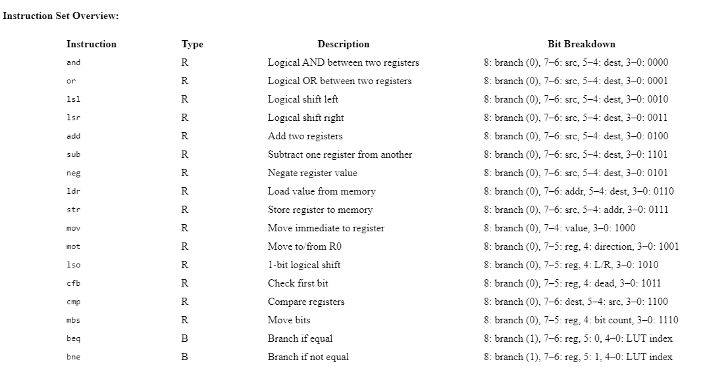

# RISC Processor
Completed
Overview: This project involved the design and implementation of a custom RISC-style processor with 8 general-purpose registers and a compact instruction set architecture. The goal was to build a minimal yet functional CPU capable of executing arithmetic, logic, and branch instructions, including support for 16-bit integer and 16-bit IEEE-754 floating-point data conversions and addition/subtraction. We used the processor's custom instruction set to write a program in Assembly Language to handle the conversion and computations. A custom compiler for the instruction set, to convert the program from ASM to machine code was also created using C++.

Key Features:

Register-register / Load-store architecture with direct and indirect addressing
Optimized register file design, prioritizing registers 0 to 3 for frequently accessed operations, while 4 to 7 are utilized for storage. Special handling of 0 as the implied destination for certain branch comparisons.
LUT-based conditional branching and control flow, storing up to 32 jump locations
Custom instructions for logical shifts, bit manipulation, and subroutine handling
Logical shigts can span one or two registers.
Support for 16-bit integer and 16-bit IEEE-754 floating-point data types
8-bit wide, 256-byte deep memory, to support indirect addressing during memory access instructions
The ALU also supports a comparison operation. Given two registers (R0 and R1), it will compare the data in these registers and return one of three values..
Control unit to decode the instruction code (op-code) and manage the flow of data across the data path.
Technology Used: Verilog, SystemVerilog, C++, ModelSim, waveform analysis tools, Assembly Language(ASM)

Process: The processor architecture was designed from the ground up, starting with the instruction set and register file. An ALU module was built to support both standard arithmetic and custom bitwise operations. A memory subsystem handled instruction and data memory independently. Testing was performed with custom testbenches and waveform outputs to validate correctness at each stage.

Challenges: Addressing edge cases in floating-point conversion, handling operand ordering in memory instructions, and eliminating infinite loop scenarios in early branch logic prototypes.

Accomplishments: Delivered a functioning RISC processor capable of running multiple programs with clean modularity and real-time branching. Achieved stable signal timing and logic under extensive test conditions.

Instruction Set Overview

